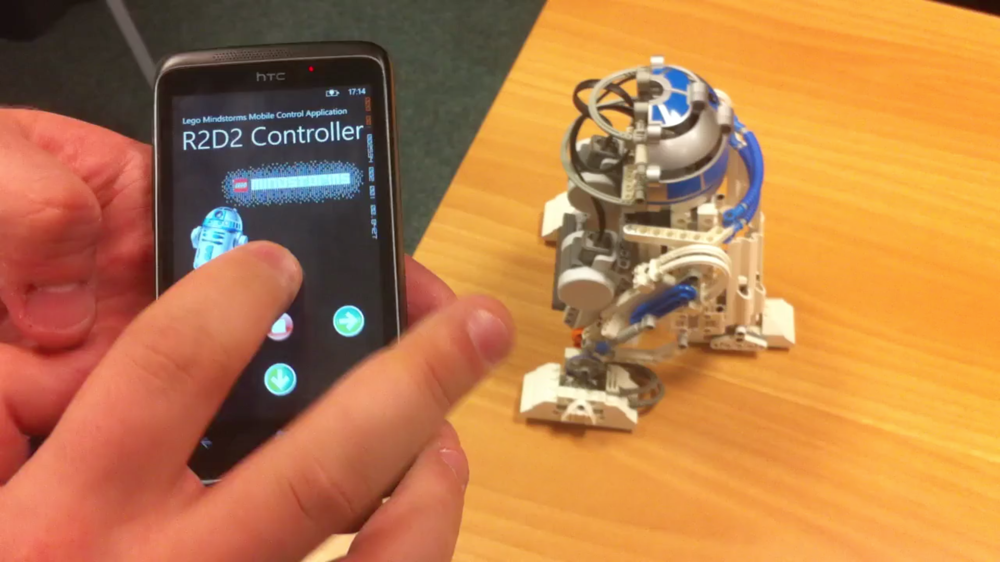

# R2D2

 

## Overview

R2D2 is a project that allows you to control a Lego Mindstorms NXT R2D2 model using Windows Phone and desktop applications. The project consists of two main components:

- **LegoApp**: A Windows Phone application for remote control of the R2D2 model
- **MindstormsNXTControl**: A desktop application that interfaces with the Lego Mindstorms NXT hardware

## Components

### LegoApp (Windows Phone)

The LegoApp is a Windows Phone application that provides a user interface for controlling the R2D2 model remotely. It includes:

- Touch-based controls for movement and actions
- Visual feedback through the interface
- Bluetooth connectivity to the Mindstorms NXT brick

### MindstormsNXTControl

This desktop application component manages the direct communication with the Lego Mindstorms NXT hardware. It utilizes the NKH.MindSqualls library to handle the low-level communication protocols.

## Getting Started

### Prerequisites

- Windows Phone SDK
- Visual Studio
- Lego Mindstorms NXT kit
- Bluetooth-enabled device

### Installation

1. Clone this repository
2. Open either `LegoApp/LegoApp.sln` or `MindstormsNXTControl/MindstormsNXTControl.sln` in Visual Studio
3. Build and deploy to your respective device

## Usage

1. Connect your Windows Phone to the NXT brick via Bluetooth
2. Launch the LegoApp on your Windows Phone
3. Use the interface to control your R2D2 model's movements and actions

## Contributing

Contributions are welcome! Please feel free to submit a Pull Request.

## License

Copyright (c) Alexandros Sigaras. All rights reserved.

Licensed under the [MIT](LICENSE) License.